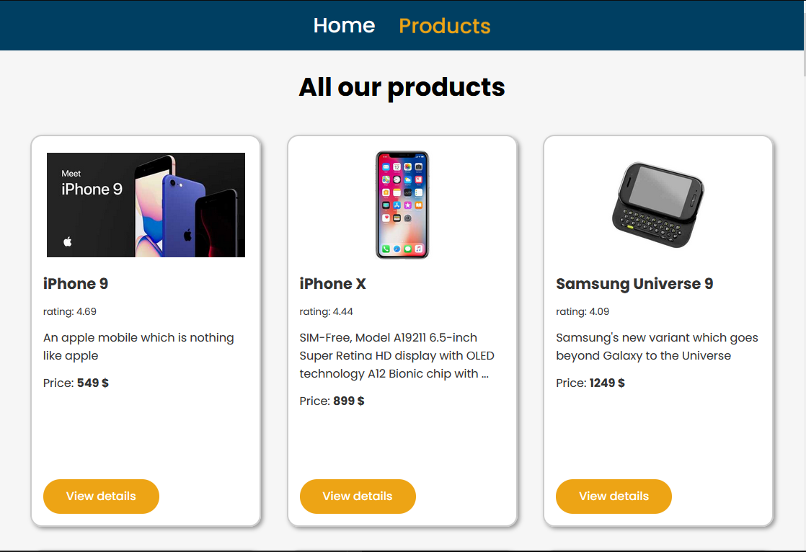
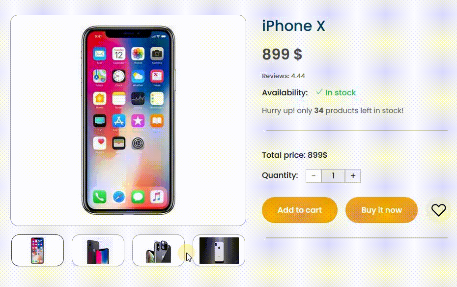

# React - online store exercise

# 🔗 [Live Preview](https://peppy-khapse-f13bb3.netlify.app)

---
## About 👋

This is a practice project for learning and practicing various concepts and features of React but mainly API calls, routing, and mapping data received from backend (Dummy JSON API in this case). 

This "online store" website allows the user to use multiple pages and select any product, upon which the information about that specific product will be displayed to the user.

The user can then change the product thumbnail and manipulate product quantity. There is also logic for product availability (see src/testing/testing.jsx)

---

## Pages 📙

* Home page: Project documentantion.

* Products page: Shows all available products in a grid layout. Each product is displayed by mapping a component over API received data.

---

## Features and Concepts Practiced 👨‍💻 

* React component-based architecture
* React Global and Local state management with useState and Redux toolkit
* Fetching data from an API using axios
* React routing using react-router-dom
* Styling using Sass
* Mapping through data and rendering dynamic content
* Responsive design with media queries

    
